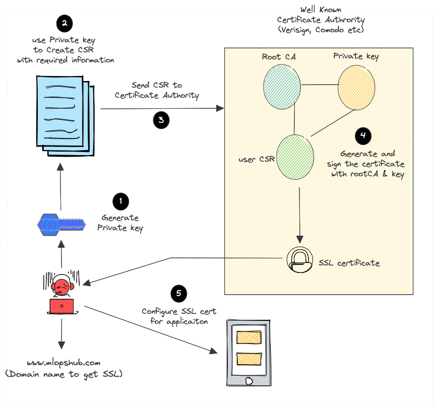

# Basic SSL localhost example

## Generate certs

Generate certs with openssl

```bash
cd certs
chmod +x cert_build.sh
./cert_build.sh localhost
```

## Run GRPC test

Add rights

```bash
chmod +x ./build.sh ./run_client.sh ./run_server.sh 
```

**Run server**

```bash
./run_client.sh
```

**Run client**

```bash
./run_client.sh
```

## Info

- *.pem - Certificate Trust Chain
- *.crt - Security Certificate File Format
- *.key - Private Key
- *.srl - Serial number generated while signing an OpenSSL

[Information resource](https://devopscube.com/create-self-signed-certificates-openssl/)


**Well-known Certificate Authority like Verisign or comodo.**



1. Create a certificate signing request (CSR) with a private key. A CSR contains details about location, organization, and FQDN (Fully Qualified Domain Name).
2. Send the CSR to the trusted CA authority.
3. The CA authority will send you the SSL certificate signed by their root certificate authority and private key.
4. You can then validate and use the SSL certificate with your applications.

**Self-signed certificate**


1. Create our own root CA certificate & CA private key (We act as a CA on our own)
2. Create a server private key to generate CSR
3. Create an SSL certificate with CSR using our root CA and CA private key.
4. Install the CA certificate in the browser or Operating system to avoid security warnings.